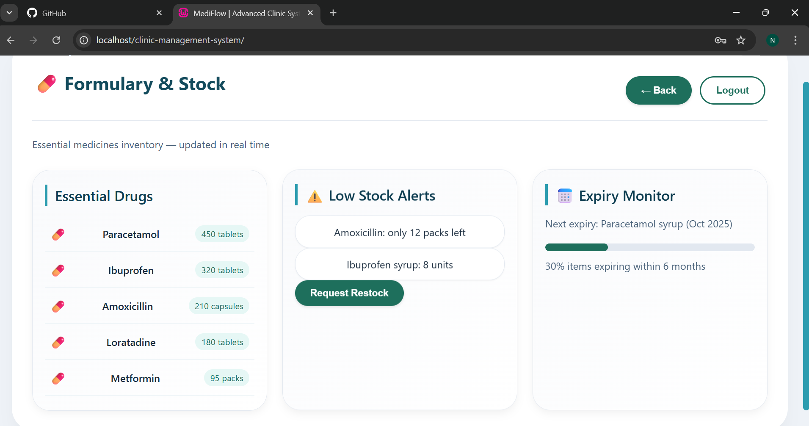

# MediFlow - Clinic Management System

## Project Overview
A responsive clinic management system with role-based dashboards (Admin, Nurse) and medicine inventory tracking.

## Laboratory Requirements
- ✅ CSS Grid Layout
- ✅ Accessibility Audit
- ✅ Keyboard Navigation
- ✅ Device Simulation

## How to Run
1. Make sure WAMP server is running
2. Open browser and go to: `http://localhost/clinic-management-system/`
3. Login with:
   - **Admin:** username: `admin`
   - **Nurse:** username: `nurse`

| Member | Contribution | File | Status |
|--------|--------------|------|--------|
| Member 1 | Global Styles & Reset | `css/member1-base.css` | ✅ Completed |
| Member 2 | Layout & Responsive Grid | `css/member2-layout.css` | ✅ Completed |
| Member 3 | UI Components | `css/member3-components.css` | ✅ Completed |
| Member 4 | Dashboard Specific Styles | `css/member4-dashboard.css` | ✅ Completed |
| Member 5 | Accessibility & Animations | `css/member5-accessibility.css` | ✅ Completed |

**Created by:** Ian Duyogan - Member 1
**Date:** March 25, 2026

## Member 2: Layout & Responsive Grid System
**Author:** Sheina Abegail Lala
**File:** `css/member2-layout.css`
**Date:** March 25, 2026

### Contributions:
1. **CSS Grid Layout** - Mobile-first grid system (1-2-3 columns)
2. **Responsive Breakpoints** - Tablet (768px), Desktop (1024px)
3. **Navigation Layout** - Flexbox navigation with backdrop blur
4. **Card Hover Effects** - Smooth transform and shadow transitions
5. **Device Optimizations** - iPhone SE, iPad Pro specific styles

## Member 3: UI Components
**Author:** Junie Saludes
**File:** `css/juniesaludes-components.css`
**Date:** March 26, 2026

### Contributions:
1. **Card Components** - Styled cards with hover effects
2. **Button Variants** - Primary, outline, secondary, danger buttons
3. **Form Inputs** - Styled inputs with focus states
4. **Badge Components** - Primary, warning, success badges
5. **Alert Messages** - Success, error, warning alerts
6. **Progress Bar** - Custom styled progress indicator
7. **Tooltip** - Hover tooltip effect
8. **Loading Shimmer** - Animated loading effect

## Member 4: Dashboard Specific Styles
**Author:** Marie Joy Maritan
**File:** `css/member4-dashboard.css`
**Date:** March 26, 2026

### Contributions:
1. **Medicine List** - Styled inventory list with icons and hover effects
2. **Patient Queue** - Queue list with status badges (waiting/checked)
3. **Vitals Entry Form** - Form styles for recording patient vitals
4. **Activity List** - Recent activities with icons and timestamps
5. **Stock Alerts** - Low and critical stock warning components
6. **Expiry Monitor** - Progress bar for medicine expiry tracking
7. **Dashboard Footer** - Footer with last updated information
8. **Responsive Adjustments** - Mobile-friendly dashboard styles

## Member 5: Accessibility & Animations
**Author:** Noven Mangaron
**File:** `css/member5-accessibility.css`
**Date:** March 26, 2026

### Contributions:
1. **Keyboard Navigation** - Focus states for Tab and Enter keys
2. **Skip Link** - Skip to main content for screen readers
3. **High Contrast Mode** - Support for prefers-contrast media query
4. **Reduced Motion** - Respects user motion preferences
5. **ARIA States** - aria-hidden, aria-expanded, aria-disabled, aria-invalid, aria-required
6. **Screen Reader Only** - .sr-only class for accessible text
7. **Animation Keyframes** - fadeIn, slideIn, scaleIn, pulse, shimmer, spin, shake, checkmark
8. **Loading States** - Loading spinners and shimmer effects
9. **Error/Success Animations** - Shake and checkmark animations
10. **Tooltip Accessibility** - Accessible tooltips
11. **Print Styles** - Print-friendly layout
12. **Custom Scrollbar** - Styled scrollbar
13. **Text Selection** - Custom selection colors

### Screenshot:


### Code Snippet:
```css
.medicine-list li {
    padding: 0.85rem 0.5rem;
    border-bottom: 1px solid #e2edf2;
    display: flex;
    align-items: center;
    justify-content: space-between;
}

.queue-status.waiting {
    background: #fef3c7;
    color: #b45309;
}

.queue-status.checked {
    background: #d1fae5;
    color: #065f46;
}

### Code Snippet:
```css
button {
    background: var(--primary-color);
    border-radius: 60px;
    transition: all 0.2s ease;
}

button:hover {
    transform: translateY(-2px);
    box-shadow: 0 4px 12px rgba(30, 111, 92, 0.3);
}

### Code Snippet:
```css
.dashboard-grid {
    display: grid;
    grid-template-columns: 1fr;
    gap: 1.5rem;
}

@media (min-width: 768px) {
    .dashboard-grid {
        grid-template-columns: repeat(2, 1fr);
    }
}

@media (min-width: 1024px) {
    .dashboard-grid {
        grid-template-columns: repeat(3, 1fr);
    }
}